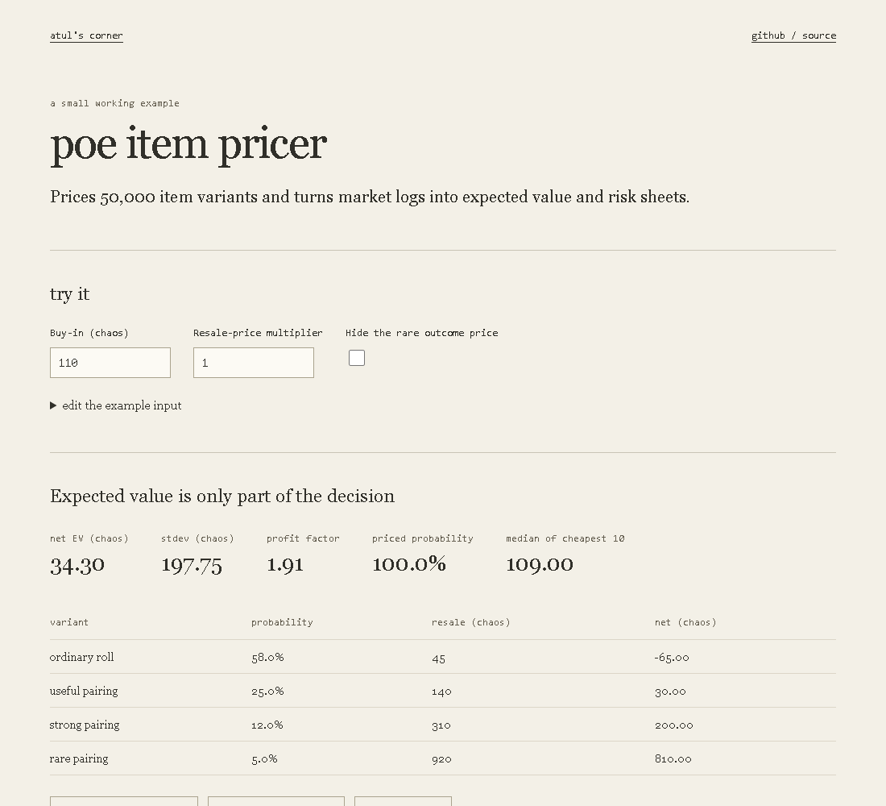

# poe item pricer

Prices 50,000 item variants and turns market logs into expected value and risk sheets.

<!-- working-example:start -->
## Try it in a minute

**[Live example](https://lolstar123.github.io/poe-item-pricer/)** · [Example code](examples/portfolio/model.mjs) · [Run locally](examples/portfolio/README.md) · [Atul's website](https://atul-kanodia-fieldnotes.atulswaggalicious.chatgpt.site)

Change the buy-in and outcome prices; inspect EV, downside and incomplete price coverage.



<!-- working-example:end -->

## The project

Residential-proxy collection logs item prices for the wider pipeline. Variant probabilities and buy-in costs feed linked sheets for expected value, dispersion and profit factor. Missing prices stay visible instead of becoming invented bargains.

A game got me into statistics. The cheapest listing is not always a usable price.

## Find your way around

| Path | What is here |
| --- | --- |
| [examples/portfolio](examples/portfolio) | Runnable browser example and fixtures |
| [model.mjs](examples/portfolio/model.mjs) | Actual calculation or workflow |
| [model.test.mjs](examples/portfolio/model.test.mjs) | Reproducible checks and edge cases |
| [PROVENANCE.md](PROVENANCE.md) | How this example relates to the full project |
| [AGENTS.md](AGENTS.md) | Instructions for extending the example |

## Quick start

```sh
python -m http.server 8000 --directory examples/portfolio
node --test examples/portfolio/model.test.mjs
```

Open http://localhost:8000. No dependencies, accounts or API keys needed.

## What is included

Authored chaos-price fixtures, no live trade connection. Return/risk is a per-outcome ratio, not an annualised investment Sharpe.
