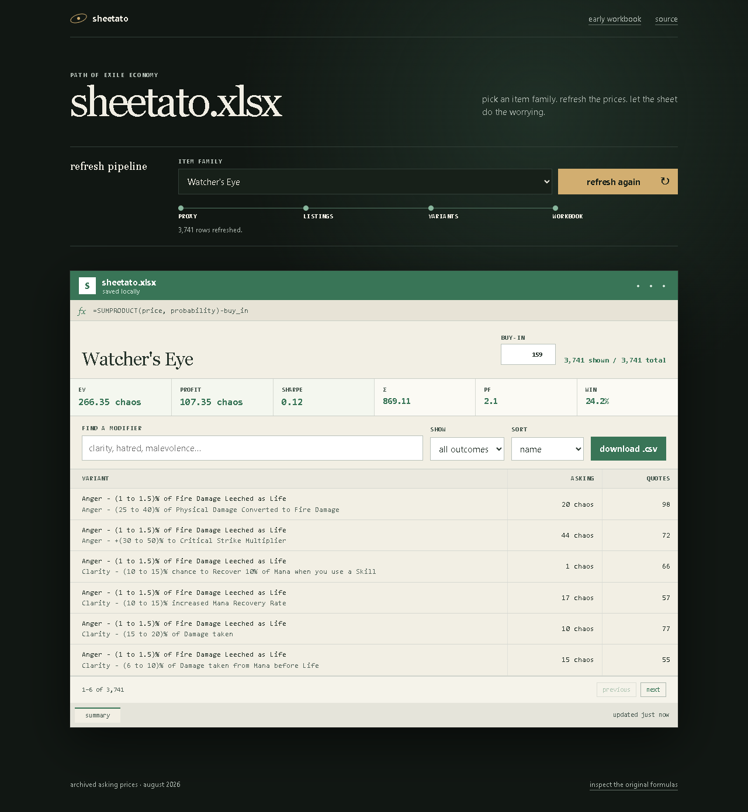

# Sheetato / PoE economy workbook

Inspect archived Path of Exile asking prices, edit a buy-in and trace expected resale, profit and risk back to source rows.

[Open the workbook](https://lolstar123.github.io/poe-item-pricer/) | [Original formulas and XLSX downloads](https://lolstar123.github.io/poe-item-pricer/archive.html)



## Try it

Choose an item family in the left rail, or the selector on a phone. Change **Buy-in** to recalculate the full outcome distribution. Search modifiers, filter aura/group or price coverage, change the order and export the matching rows. **Inspect source** shows the worksheet cell, measurement time, outcome weight and separately supplied floor.

**Reload archive** fetches and validates the bundled JSON again. It retains the selected family, filters, page and edited buy-in; failure keeps the loaded observations and enables retry. Reloading does not collect current trade listings or change historical measurement dates.

Watcher's Eye has explicit **2 mods / observed** and **3 mods / modelled** controls. Three-mod mode enumerates 105,995 combinations and values each using the maximum of its three contained pair quotes. Its equal weights and 426.5 chaos default buy-in are labelled scenario inputs, not observed triple prices or verified drop probabilities.

[Phone view](examples/portfolio/preview-mobile.png)

## Archive contents

| Family | Outcomes | Priced | Model boundary |
| --- | ---: | ---: | --- |
| Watcher's Eye / two mods | 3,741 | 3,741 | 87 modifiers; equal-pair scenario |
| Split Personality | 36 | 36 | Equal-variant scenario |
| Forbidden Flame | 166 | 165 | Missing outcome retains its weight |
| Forbidden Flesh | 166 | 165 | Missing outcome retains its weight |
| Sublime Vision | 17 | 17 | Median of ten quotes; floors shown separately |
| Balance of Terror | 153 | 138 | Uniform-pair scenario |
| Mageblood double implicits | 171 | 66 | Conditional on the double-implicit branch |
| Voices | 4 | 4 | Archived weights: 670 / 300 / 25 / 5 |

The archive is dated **15 August 2026**; row measurement timestamps are retained. These are asking prices, not completed sales. Chaos and divine remain separate units. Missing prices block full EV and risk rather than becoming zero or disappearing from the probability distribution. Filters only change the ledger, never the EV population.

Expected resale and expected profit stay visible. Open **Risk measures** for profitable-outcome probability, one-roll standard deviation, profit divided by volatility and profit factor. The profit/volatility ratio is not annualised Sharpe. Blank or invalid buy-in clears cost-dependent measures; known resale EV remains visible.

## Run locally

The browser demo has no package dependencies or build step. Serve it with Python 3:

```sh
git clone https://github.com/LolStar123/poe-item-pricer.git
cd poe-item-pricer
python -m http.server 8000 --directory examples/portfolio
```

Open **http://localhost:8000/**. Use a second terminal for checks. Node 18 or later runs the independent calculation tests:

```sh
node --test examples/portfolio/model.test.mjs
```

The headless browser checks use Python Playwright. On Windows they launch installed Google Chrome; on other platforms install Playwright Chromium:

```sh
python -m pip install playwright
# Needed when not using the installed Windows Chrome:
python -m playwright install chromium
python tools/browser_audit.py
```

Verified on Python 3.11.9, Node 24.12.0 and Playwright 1.57.0. Browser checks use a temporary local server, cover all eight families, valuation modes, costs, reload/failure/retry, CSV, original formulas and 390px layouts, and save evidence under ignored `output/redesign/`.

## Code map

| Path | Responsibility |
| --- | --- |
| `examples/portfolio/browser.mjs`, `browser.css`, `index.html` | Family ledger, validated archive reload, editable assumptions, provenance and CSV |
| `examples/portfolio/datasets.mjs` | Search/order adapter, triple enumeration and full-distribution calculation |
| `examples/portfolio/model.mjs` | Expected value, coverage, dispersion, win probability, profit factor and histogram |
| `examples/portfolio/data/datasets.json` | Whitelisted recovered price observations and weights |
| `examples/portfolio/archive.html`, `app.mjs` | Editable early valuation cases and original worksheet formula inspection |
| `examples/portfolio/assets/*.xlsx` | Three byte-preserved original workbooks |
| `tools/export_datasets.py`, `tools/export_archive.py` | Reproducible read-only workbook extraction with openpyxl |
| `tools/browser_audit.py` | Headless desktop/mobile flow and error checks |
| `original/buyin.py` | Original collector's median-of-ten and separate-floor buy-in logic |

The broader project collected trade-price evidence into linked workbooks. This public demo reloads a finite archive; it does not run residential proxies, authenticate a trade session or write XLSX files. [Provenance](PROVENANCE.md) records source hashes, extraction ranges, price definitions and model assumptions.
